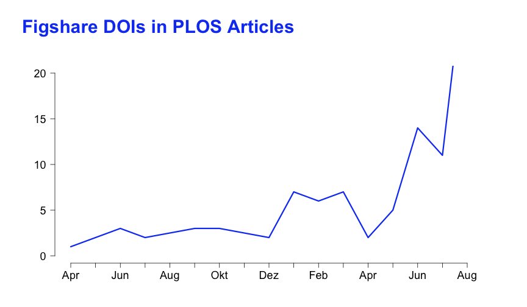

## Install packages 

If the below packages are not installed already, then load package


```r
# install.packages(c('plyr','rplos','knitr','zoo'))
library("plyr")
library("knitr")
library("rplos")
library("zoo")
```


## Read in data


```r
input.name <- "../data/datacite_dois_in_plos_articles_2014-09-10.csv"

# get list of plos DOIs with associated DataCite DOIs from CSV file
alm <- read.csv(input.name, stringsAsFactors = FALSE, header = TRUE, sep = ",")
```


## Analyze data

Analyze where the DataCite DOIs come from using the DOI prefix

```r
datacenters <- count(alm, vars = "prefix")

# DOI prefixes are not numbers
datacenters$prefix <- as.factor(datacenters$prefix)

# generate markdown table
kable(datacenters, format = "markdown")
```

|prefix   |  freq|
|:--------|-----:|
|10.1594  |    29|
|10.4123  |     1|
|10.5061  |   346|
|10.5281  |     1|
|10.5441  |     5|
|10.5524  |     2|


Most DataCite DOIs are from Dryad (10.5061) and some from Pangaea (10.1594). Not a single DOI is from figshare, which could mean that that there are no Figshare datasets in PLOS papers, or more likely that figshare isn't sending the PLOS article DOI in the metadata it sends to DataCite. Let's see whether we find any Figshare DOIs by doing a fulltext search in PLOS.


```r
# Search the PLOS Search API
figshare <- searchplos(terms = "everything:\"10.6084/m9.figshare\"", fields = "id,title,publication_date", 
    toquery = "doc_type:full", limit = 200, highlighting = TRUE, key = "KEY")
figshare <- figshare$data
figshare$publication_date <- as.Date(figshare$publication_date)

# Then write a csv file
output.name <- "../data/figshare_dois_in_plos_articles_2014-10-02.csv"
write.csv(figshare, output.name, quote = TRUE, row.names = FALSE)
```


We find [146 PLOS articles](../data/figshare_dois_in_plos_articles_2014-10-02.csv) that cite at least one figshare DOI. This is a problem, as the DataCite metadata of these figshare DOIs don't contain any reference (`isReferencedBy`) to the PLOS article.

## Linked DataCite datasets over time

We focus on Dryad and figshare, as they are responsible for most of the DataCite DOIs cited in PLOS articles. Let's do the analysis for every PLOS article published until August 31, 2014.


```r
# only analyze Dryad DOIs, and only until the end of August 2014
dryad <- subset(alm, (substr(alm$data_doi, 1, 7) == "10.5061"))
dryad <- subset(dryad, dryad$publication_date <= "2014-08-31")

# Create a month column
dryad$month <- as.yearmon(dryad$publication_date)
summary <- ddply(dryad, .(month), "nrow")

# Plot the chart.
main <- "Dryad DOIs in PLOS Articles"
opar <- par(mai = c(0.5, 0.75, 1, 0.5), omi = c(0.5, 0.5, 0.5, 0.5), mgp = c(3, 
    1, 0), fg = "black", cex = 1, cex.main = 2.5, cex.lab = 2, cex.axis = 1.5, 
    col.main = "#1447f2", col.lab = "black", col.axis = "black")
plot(summary$month, summary$nrow, type = "l", lwd = 3, las = 1, xlab = NA, ylab = NA, 
    ylim = c(0, 20), xaxp = c(2007, 2014, 6), bty = "n", col = "#1447f2")
title(main = main, outer = TRUE, line = -1.25, adj = 0)
opar <- par()
```

 


```r
# only analyze figshare DOIs, and only until the end of August 2014
figshare <- subset(figshare, figshare$publication_date <= "2014-08-31")

# Create a month column
figshare$month <- as.yearmon(figshare$publication_date)
summary <- ddply(figshare, .(month), "nrow")

# Plot the chart.
main <- "Figshare DOIs in PLOS Articles"
opar <- par(mai = c(0.5, 0.75, 1, 0.5), omi = c(0.5, 0.5, 0.5, 0.5), mgp = c(3, 
    1, 0), fg = "black", cex = 1, cex.main = 2.5, cex.lab = 2, cex.axis = 1.5, 
    col.main = "#1447f2", col.lab = "black", col.axis = "black")
plot(summary$month, summary$nrow, type = "l", lwd = 3, las = 1, xlab = NA, ylab = NA, 
    ylim = c(0, 20), xaxp = c(2007, 2014, 6), bty = "n", col = "#1447f2")
title(main = main, outer = TRUE, line = -1.25, adj = 0)
opar <- par()
```

 


## Data Citation of Dryad DOIs

Let's limit the further analysis to Dryad for a more homogenous dataset.


```r
# only analyze Dryad DOIs
alm <- subset(alm, (substr(alm$data_doi, 1, 7) == "10.5061"))
```


Let's see whether the Dryad DOIs are mentioned in the PLOS article at all. We can do a fulltext search with all Dryad DOIs that we found.
Doing a manual query against PLOS Search we get the following results (multiple hits are possible so the sum is above 346):

|  section              |freq|
|:----------------------|---:|
|introduction           |   2|
|materials & methods    | 179|
|results & discussion   |  50|
|conclusions            |   4|
|supporting information |  19|
|figure & table captions|   5|
|references             |  12|
|no mention             |  77|


```
## [1] "overview.md"
```

