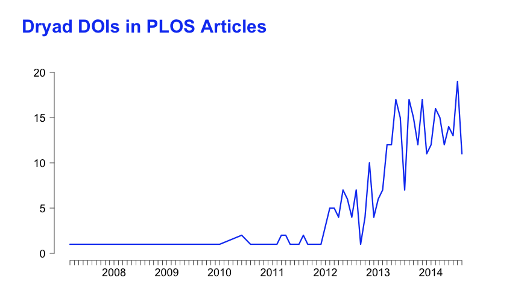

## Install packages 

If the below packages are not installed already, then load package


```r
# install.packages(c('plyr','alm','knitr','zoo'))
library("plyr")
library("knitr")
library("alm")
library("zoo")
```


## Read in data


```r
input.name <- "../data/datacite_dois_in_plos_articles_2014-09-10.csv"

# get list of plos DOIs with associated DataCite DOIs from CSV file
alm <- read.csv(input.name, stringsAsFactors = FALSE, header = TRUE, sep = ",")
```


## Analyze data

Analyze where the DataCite DOIs come from using the DOI prefix

```r
datacenters <- count(alm, vars = "prefix")

# DOI prefixes are not numbers
datacenters$prefix <- as.factor(datacenters$prefix)

# generate markdown table
kable(datacenters, format = "markdown")
```

|prefix   |  freq|
|:--------|-----:|
|10.1594  |    29|
|10.4123  |     1|
|10.5061  |   346|
|10.5281  |     1|
|10.5441  |     5|
|10.5524  |     2|


Most DataCite DOIs are from Dryad (10.5061) and some from Pangaea (10.1594). Not a single DOI is from figshare, which could mean that that there are no Figshare datasets in PLOS papers, or more likely that figshare isn't sending the PLOS article DOI in the metadata it sends to DataCite.

Let's limit the further analysis to Dryad for a more homogenous dataset.


```r
# only analyze Dryad DOIs
alm <- subset(alm, (substr(alm$data_doi, 1, 7) == "10.5061"))
```


## Dryad DOIs in PLOS Articles by Month

We can look at how the number of Dryad DOIs in PLOS papers evolved over time.


```r
# we only have partial data for September 2014
alm_by_month <- subset(alm, alm$publication_date <= "2014-08-31")

# Create a month column
alm_by_month$month <- as.yearmon(alm_by_month$publication_date)
summary <- ddply(alm_by_month, .(month), "nrow")

# Plot the chart.
main <- "Dryad DOIs in PLOS Articles"
opar <- par(mai = c(0.5, 0.75, 1, 0.5), omi = c(0.5, 0.5, 0.5, 0.5), mgp = c(3, 
    1, 0), fg = "black", cex = 1, cex.main = 3, cex.lab = 2, cex.axis = 1.5, 
    col.main = "#1447f2", col.lab = "black", col.axis = "black")
plot(summary$month, summary$nrow, type = "l", lwd = 3, las = 1, xlab = NA, ylab = NA, 
    ylim = c(0, 20), xaxp = c(2007, 2014, 6), bty = "n", col = "#1447f2")
title(main = main, outer = TRUE, line = -1.25, adj = 0)
opar <- par()
```

 


```
## [1] "overview.md"
```


